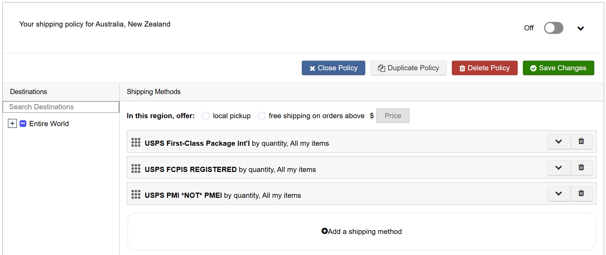
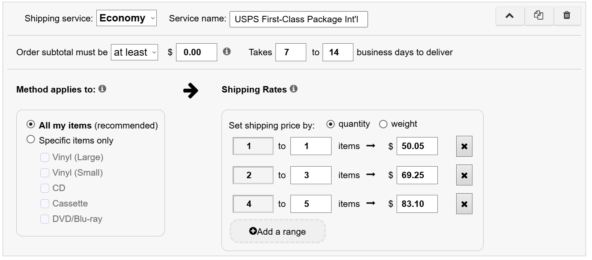
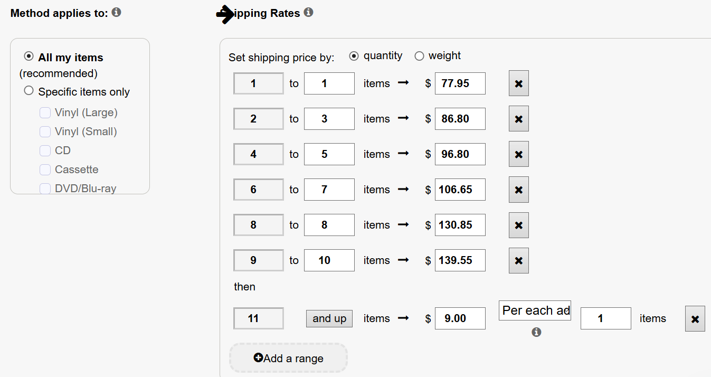

# discoship
Create international shipping policies for [discogs.com](https://www.discogs.com/)
```
@@@@@@@@@@@@@@@        @@@@@@@@
@@@@@@@@@@@@@@@@@@     @@@@@@@@
@@@@@@@@ @@@@@@@@@@    @@@@@@@@
@@@@@@@@   @@@@@@@@@
@@@@@@@@    @@@@@@@@@  @@@@@@@@      @@@@@@@@           @@@@@@@              @@@@@
@@@@@@@@     @@@@@@@@  @@@@@@@@   @@@@@@@@@@@@@      @@@@@@@@@@@@@      @@@@@@@@@@@@@@@
@@@@@@@@     @@@@@@@@  @@@@@@@@  @@@@@@@@@@@@@@@   @@@@@@@@@@@@@@@@  @@@@@@@@@@@@@@@@@
@@@@@@@@     @@@@@@@@@ @@@@@@@@ @@@@@@@   @@@@@@@  @@@@@@@  @@@@@@@ @@@@@@@@@@@@@@@@@   @@@
@@@@@@@@     @@@@@@@@@ @@@@@@@@ @@@@@@@    @@@@@  @@@@@@@@  @@@@@@@@@@@@@@@@@@@@@@@  @@@@@@@
@@@@@@@@     @@@@@@@@@ @@@@@@@@ @@@@@@@@          @@@@@@@@      @@@@@@@@@@@@@@@@@@ @@@@@@@@@@
@@@@@@@@     @@@@@@@@@ @@@@@@@@  @@@@@@@@@       @@@@@@@@@      @@@@@@@@@@@ @@@@@ @@@@@@@@@@@@
@@@@@@@@     @@@@@@@@@ @@@@@@@@   @@@@@@@@@@     @@@@@@@@@     @@@@@@@@@@@@       @@@@@@@@@@@@@
@@@@@@@@     @@@@@@@@  @@@@@@@@    @@@@@@@@@@@   @@@@@@@@@     @@@@@@@@@@@@  @@   @@@@@@@@@@@@@
@@@@@@@@     @@@@@@@@  @@@@@@@@      @@@@@@@@@@@ @@@@@@@@@     @@@@@@@@@@@@       @@@@@@@@@@@@
@@@@@@@@     @@@@@@@@  @@@@@@@@        @@@@@@@@@@ @@@@@@@@     @@@@@@@@@@@@@@@@@@ @@@@@@@@@@@@
@@@@@@@@    @@@@@@@@   @@@@@@@@          @@@@@@@@ @@@@@@@@      @@@@@@@@@@ @@@@@@@@@@@@@@@@@@
@@@@@@@@    @@@@@@@@   @@@@@@@@ @@@@@@    @@@@@@@  @@@@@@@   @@@@@@@@@@@  @@@@@@@@@@@@@@@@@@
@@@@@@@@@@@@@@@@@@@    @@@@@@@@ @@@@@@@@@@@@@@@@@  @@@@@@@@@@@@@@@@@@@   @@@@@@@@@@@@@@@@@
@@@@@@@@@@@@@@@@@@     @@@@@@@@  @@@@@@@@@@@@@@     @@@@@@@@@@@@@@      @@@@@@@@@@@@@@@@
@@@@@@@@@@@@@@@        @@@@@@@@    @@@@@@@@@@@        @@@@@@@@@@       @@@@@@@@@@@@@@
                         __  o                            |            .'  @@@@@
                        /  |/                         \   |   /                       ♪
                      _/___|________        ♪      `.  .d88b.   .'       ♪
                     /  _______   __\                 d888888b      ♪         ♪
   _______          /  /_o_||__| |        --     --  (88888888)  --     --         ♪
    \_\_\_\________/___          |           ♪        Y888888Y              ♪            ♪
             \         \_________|____________  ♪ .'   `Y88Y'   `.   ♪   _________
              \     ||                         ♪    ♪ /      \    `    ♪        ♪ |
               \  +_||_+   ()  ()     ♪  ┗(･o･)┛ ♪        ♪      ♪     ┌(･o･)┓    |
                \                        ♪  └|∵|┐  ♪  ♪ └|∵|┘  ♪  ♪ ┌|∵|┘     ♪   |
                 \     _  ,,          _        ♪  ┏(･o･)┛   ♪♪  ┗(･o･)┓   ♪      /
 ^^^^^^^^^^^^^^^^ \_.=" )"  "-._____,' ";_______________________________________/_^^^^^^
   ^^^^  ^^^^                                                                  \__|==% ^^
  ^^         ^^^^^^^^       ^^^^ ^^^ ^^^^^       ^^^^^^^^^^  ^         ^^^^
^^^   ^^^^          ^^^^^^^^^^^^          ^^^^     ^^       ^^^^^    ^^       ^^^^^
```

International shipping is expensive, and errors can be costly.  The goal of
this package is to make rate calculations a little less error-prone,
particularly for those of us who don't do it very often.

Initially I expected the [Discogs API](https://www.discogs.com/developers) to
allow creating & managing shipping policies, but that seems not to be the
case, so the best this project can do is generate pricing tables for the 20
Country Price Groups **USPS** uses to determine rates for international
packages, which sellers can use as a guide when manually creating policies.

It's probably wise on their part to not allow using their API that way, their
policies are already kind of confusing and fragile, and it would probably
cause a ton of problems & service requests.

## USAGE
I am personally just getting used to the issues involved with international
shipping, so don't have it enabled by default in my store, but I am frequently
asked if I will do it for a specific item, so this package is useful when I
get such requests because I just do:
```sh
$ discoship ingest usps --all
```
to update the rate tables, then generate a policy for the country in question:
```sh
$ discoship policy --country in --service FCPIS
```
which gives me a pricing table for that USPS service, for that country.

## USPS Shipping Policies
**USPS** *FCPIS* & *PMI* services are the only rates currently generated (even
that is an exaggeration, *PMI* is still being worked on).  There exists also a
*PMI Express* which is even more expensive, and I will get to eventually.

So far, I only have experience with sending *FCPIS* (First Class Package
Int'l) packages.  *PMI* is *Priority Mail International*, and is maybe a bit
faster, but is definitely considerably more expensive.  In my experience, the
cost of the relatively "budget" option *FCPIS* turns off most potential
international buyers.

### FCPIS: First-Class Package International Service

  * Assumes standard record mailer type boxes (12.5" x 12.5" x 0.5/1.0")
  * Max weight 4LBS (64OZ)

The policy generator will create two price options for *FCPIS*: registered mail
and not-registered.  What "registered" means for international packages varies
by country, it is significantly more expensive, you can read more about it
[here](https://faq.usps.com/articles/FAQ/What-is-Registered-Mail-International)

The other/non-registered *FCPIS* rate generated includes a small fee for a
"Certificate of Mailing", which is a scammy sort of extra receipt service **USPS**
provides for senders to absolve them of accusations of not sending the
package at all in the case of it becoming "lost in the mail".  It's a small
enough fee ($2.50 at time of writing) that as sender, I feel it to be worth it.

*FCPIS* is the default policy, so you can omit the `--service FCPIS` argument.
To generate a policy for a country, you only have to specify the
[ISO3166 country code](https://en.wikipedia.org/wiki/List_of_ISO_3166_country_codes):

***Note, example output is from June 2026, this is not necessarily today's rate***
```sh
$ discoship policy --country in

    USPS First Class Package Int'l (FCPIS)
    FCPIS Price Group: 10
    Rates last updated: 2026-06-11 07:13:32 (UTC)
    Countries: India

    There are two rates to choose from for FCPIS, registered or not:

    NOT Registered:

    Qty LPs:                       1 LP    2-3 LPs*    4-5 LPs
    -------------------------+----------+----------+----------+
    Base Shipping            |    34.80 |    50.15 |    68.65 |
    -------------------------+----------+----------+----------+
    Packaging/Materials Fee  |     1.50 |     1.50 |     1.50 |
    -------------------------+----------+----------+----------+
    Certificate of Mailing   |     2.50 |     2.50 |     2.50 |
    -------------------------+----------+----------+----------+
    TOTAL                    |    38.80 |    54.15 |    72.65 |
    -------------------------+----------+----------+----------+

    REGISTERED

    Qty LPs:                       1 LP    2-3 LPs*    4-5 LPs
    -------------------------+----------+----------+----------+
    Base Shipping            |    34.80 |    50.15 |    68.65 |
    -------------------------+----------+----------+----------+
    Packaging/Materials Fee  |     1.50 |     1.50 |     1.50 |
    -------------------------+----------+----------+----------+
    Registered**             |    22.00 |    22.00 |    22.00 |
    -------------------------+----------+----------+----------+
    TOTAL                    |    58.30 |    73.65 |    92.15 |
    -------------------------+----------+----------+----------+

    *  Weights for 2 * 1LPs packed up vary, but are very close to
       price group boundary of 32oz (and double-LPs even more so),
       if you are ordering 2LPs it is probably worth it to reach out
       to me and ask me to pack up your order & edit real shipping
       cost before paying for your order, it could save you some money

    ** International Registered Mail means different things for
       different countries, see
       https://www.usps.com/international/insurance-extra-services.htm
```
Base Shipping is actual USPS rate, determined by weights of records packed up
in mailers, and mapped to the FCPIS rate classes.  1 LP boxed up weighs ~20oz,
which is firmly in the 16-32oz range for that weight class, as mentioned @
first asterisk, 2xLPs boxed up weighs very close to the 32oz border between
1 & 2-3LP rates, so I try to offer to try to box it up before payment & check
the actual weight.

Packing materials, certificate of mailing, and registered fees are all
configurable via the `discoship config` subcommand.  $1.50 is about right
for the dead basic boxes I buy -- if you buy fancy ones, you might want to
up that.  Certificate of mailing always seems like a scammy sort of receipt
from USPS, but as a seller I feel better buying one, you can set it to $0 in
the config if you don't use them.


### PMI: Priority Mail Internationsl

### PMEI: Priority Mail Express Internationsl


## Updating Discogs Shipping Policies

As of August 2026, navigate to *Account -> Settings* from the profile pic menu.
Select *Seller* from the options on the left.  Scroll down to find the button
labelled *Edit Shipping Policies*, Click *Add A Shipping Policy* (or if one
exists for the destination, click on it to edit it).

For example, let's create a policy for FCPIS Price Group 12 (Australia & New
Zealand), `discoship` has provided us with these charts:
```sh
    USPS First Class Package Int'l (FCPIS)
    FCPIS Price Group: 12
    Rates last updated: 2026-08-14 13:47:24 (UTC)
    Countries: Australia, New Zealand

    There are two rates to choose from for FCPIS, registered or not:

    NOT Registered:

    Qty LPs:                       1 LP    2-3 LPs*    4-5 LPs
    -------------------------+----------+----------+----------+
    Base Shipping            |    46.05 |    65.25 |    79.10 |
    -------------------------+----------+----------+----------+
    Packaging/Materials Fee  |     1.50 |     1.50 |     1.50 |
    -------------------------+----------+----------+----------+
    Certificate of Mailing   |     2.50 |     2.50 |     2.50 |
    -------------------------+----------+----------+----------+
    TOTAL                    |    50.05 |    69.25 |    83.10 |
    -------------------------+----------+----------+----------+

    REGISTERED

    Qty LPs:                       1 LP    2-3 LPs*    4-5 LPs
    -------------------------+----------+----------+----------+
    Base Shipping            |    46.05 |    65.25 |    79.10 |
    -------------------------+----------+----------+----------+
    Packaging/Materials Fee  |     1.50 |     1.50 |     1.50 |
    -------------------------+----------+----------+----------+
    Registered**             |    22.00 |    22.00 |    22.00 |
    -------------------------+----------+----------+----------+
    TOTAL                    |    69.55 |    88.75 |   102.60 |
    -------------------------+----------+----------+----------+
```
### Select Country/Countries
Use the wonky country selection menu to select the country or countries of
interest, the policy title will update automatically to *"Your shipping policy
for Australia, New Zealand"* as you select the countries.
### Add Shipping Method(s)
Click on *"Add a shipping method"*

Select **Shipping Service**, options are *Economy*, *Standard*, and *Express*,
I'm not sure if you are allowed to have more than one of each kind, provided
they are named differently, the way I've done it so far is to create one of
each:
<dl>
    <dt>Economy</dt>
    <dd>USPS First-Class Package Int'l</dd>
    <dt>Standard</dt>
    <dd>USPS FCPIS REGISTERED</dd>
    <dt>Express</dt>
    <dd>USPS PMI *NOT* PMEI</dd>
</dl>
Though once **PMEI** is supported I might use that one for *Express* (since it
is the name), and see if having two *Standard* rates with different names
(*FCPIS REGISTERES* and *PMI*) will work.

### Edit Rates for Economy
Select the shipping policy you want to set rates for, for example our *Economy* **FCPIS (not registered)** option

Make sure the **Shipping Rates** option *"Set shipping price by"* is set to **quantity**

And the `discoship` output should map pretty cleanly to 3 ranges (for **FCPIS**):
<ul>
    <li>**1** to **1** items -> **50.05**</li>
    <li>**2** to **3** items -> **69.25**</li>
    <li>**4** to **5** items -> **83.10**</li>
</ul>
<br />

#### Incomplete Shipping Policies
If you try to save at this point you may see an error like:
<div style="background-color:pink; border:1px solid black; margin:20px; padding:20px;">
This shipping policy is incomplete, it is missing one shipping method that covers:

All Order sizes - The final rate range must end with "and up" to handle any number of items or weights.
</div>
I remember now, this is why I added rudimentary support for *PEI*, you would
think it would reasonably assume you only support shipping up to 5 items via this
policy, especially **FCPIS** which caps at 64oz, but every policy has to have
an option supporting *n* items, so...

### Edit Rates for Standard
Repeat the above to create a *Standard* policy, using the prices from the
**FCPIS REGISTERED** table, and then create an open-ended policy for **PEI**,
which will work for packages up to 66lbs

### Edit Rates for Open-Ended PEI Option
As of `discoship` version `1.1.1` the only way to see the **PMI** rates is to
run in debug mode:
```sh
discoship --debug policy --country nz --service PMI
```
which will output this pricing data structure (among a bunch of other stuff):
```python
  {
    'country_name': 'New Zealand',
    'cc2': 'NZ',
    'cc3': 'NZL',
    'usps_svc_code': 'PMI',
    'usps_price_group': 12,
    'usps_svc_name': "Priority Mail Int'l",
    'svc_max_weight_oz': 160,
    'svc_max_value': 1025.0,
    'rate_1lp': 77.95,
    'rate_2lp': 86.8,
    'rate_3lp': 86.8,
    'rate_4lp': 96.8,
    'rate_5lp': 96.8,
    'rate_6lp': 106.65,
    'rate_7lp': 106.65,
    'rate_8lp': 130.85,
    'rate_9lp': 139.55,
    'rate_10lp': 139.55,
    'rate_11lp': 148.5,
    'rate_12lp': 157.3,
    'rate_13lp': 157.3,
    'rate_14lp': 166.15,
    'rate_15lp': 166.15,
    'rate_16lp': 166.15,
    'max_weight_lbs': 66,
    'flat_rate_price_group': 6
  }
```
Use this data to populate the price table for the **PEI** policy, and be sure
to leave the final item open-ended with the **and up** option, and an
appropriate amount *per each added item*.  If the example seems a bit high,
keep in mind that it's extremely unlikely anyone will ever use this option,
and if somoehow they do, clearly they are not worried about pinching pennies.
<br />

### Lack of ability to test policies
Unfortunately, there doesn't seem to be a way to view your listings as a user
from another counrty would see them (perhaps if you have a VPN you can select
specific countries to route your traffic through), which is another reason I
don't like to enable these policies unless I am communicating directly with a
potential buyer & I can ask them, "you should see these rates, does it look
like that?"

### Update "Shipping Policy" Text on your seller page
I only enable international policies for brief windows of time where I am
communicating with the buyer already, so I don't leave these policies active
after the sale (just toggle the green **Active** switch on your *Shipping
Policies* settings page to the off position).

If you do intend to enable your policies long-term, you should probably update
your *Seller Terms* on your *Settings -> Seller* page to describe the policy.
I don't know if Discogs allows you to use the HTML `<pre></pre>` tag for
preformatted content, but if you paste the `discoship` rate tables you
probably want to somehow make sure it is a monospace font.

## USPS Price Groups


## INSTALL
```sh
$ git clone -o github git@github.com:kennethd/discoship.git
$ cd discoship
$ ./bin/install
$ source ./venv-discoship/bin/activate
$ which discoship
```
The last command should output something similar to `/home/kenneth/git/discoship/venv-discoship/bin/discoship`

Note, if you use `https` for git (rather than ssh), try `git clone -o github https://github.com/kennethd/discoship.git`

Sorry, I don't know what the equivalent commands would be on Windows

### Dependencies
The only dependency is [Python3](https://www.python.org/downloads/), and `bash`
for the install script (which only creates a virtualenv & uses `pip` to
install the package, so probably easy to work around for Windows users).  The
oldest `python3` I've tested it with is `3.10`.

### Refresh Data
`discoship` installs with a hopefully up-to-date database of rates & etc, but
just to be sure, the first thing you should do (and going forward, do
regularly), is refresh the database with current **USPS** rates:
```sh
$ discoship --info init --all
```
If anything fails, replacing `--info` with `--debug` might provide more insight.

You can re-run specific pieces of the ingest process, see `discoship --help`
and `discoship ingest --help`, `discoship ingest usps --help` etc

### Periodic updates
Because `discoship init --all` recreates the entire database from scratch,
including any config options you may have set, rate change info can be
re-ingested specifically:
```sh
$ discoship --info ingest usps --all
```

## CONFIG

There is a `discoship config` subcommand that allows you to view or set
various options & metadata, see `discoship config --help`

To check when the rates were last updated, do:
```sh
discoship config --dump | grep last_ingest
```

### Mapping record weights and USPS weight-based rate tables

My (admittedly small sample size) experiments packing up records and weighing
them resulted in these settings:
```json
{
  "weight_1_lp_oz": 20,
  "weight_2_lp_oz": 34,
  "weight_3_lp_oz": 42,
  "weight_4_lp_oz": 52,
  "weight_5_lp_oz": 60,
  "weight_6_lp_oz": 70
}
```
Since *FCPIS* max weight is 64oz, I didn't go any higher than that, but for
*PMI* prices have been ingested up to 10lbs.


## ROADMAP

  * Upon receiving my first int'l order, I noticed transaction fees are not applied
    to the subtotal only, but to shipping costs as well -- which comes to about
    50-60&cent; for a typical stateside order, but eating 9% of a $60 shipping
    bill sucks, and inflates the PayPal fees further, so I am considering adding a
    config option to compensate for fees on high int'l shipping costs
  * Better CD support

## CHANGELOG


### 2026-08-16: version 1.1.2
<dl>
  <dt>Added "Updating Shipping Policies" section to docs</dt>
  <dd>Instructions for enabling & managing shipping policies (PEI support still rudimentary)</dd>
</dl>

### 2026-08-14: version 1.1.1
<dl>
  <dt>Re-ingested USPS rate data</dt>
  <dd></dd>
  <dt>Improved docs a bit</dt>
  <dd></dd>
  <dt>Added support for Python 3.10</dt>
  <dd>Project had previously only been tested with >=3.11</dd>
</dl>

### 2026-06-09: version 1.1.0
<dl>
  <dt>FCPIS policy generator updated</dt>
  <dd>Updated FCPIS rates ingestor to accomodate new 8-16 oz weight class</dd>

  <dt>Added `./bin/test` script</dt>
  <dd>preferred `pytest` args were getting kind of long</dd>

  <dt>Increased test coverage to 85%</dt>
  <dd>`db.py` test coverage is now at 95%</dd>
</dl>

### 2025-11-23: version 1.0.0
<dl>
  <dt>Moved `config` table to new `userdata.db`</dt>
  <dd>re-ingested usps rate data can be committed independently of user config</dd>

  <dt>Added `init --all`</dt>
  <dd>Now all the pieces work independently, add convenient post-install "do everything" flag</dt>
</dl>

### 2025-11-20
<dl>
  <dt>Added `./bin/install` & `./bin/clean` scripts</dt>
  <dd>
    Simplified install instructions/procedure.  This project doesn't warrant
    external dependencies for a build system, but if you have `bash`, you have
    the option of using these scripts
  </dd>
</dl>

## AUTHOR
I usually only operate my store when between programming gigs; if the
[store](https://www.discogs.com/seller/kennethd/profile) is open, please buy a
record!  And if you like the code, and have a Python gig, reach out & hire me!

If you are a `discogs` hiring manager for the dev team, I do not currently
live in a state you hire in, but I might be open to changing that

